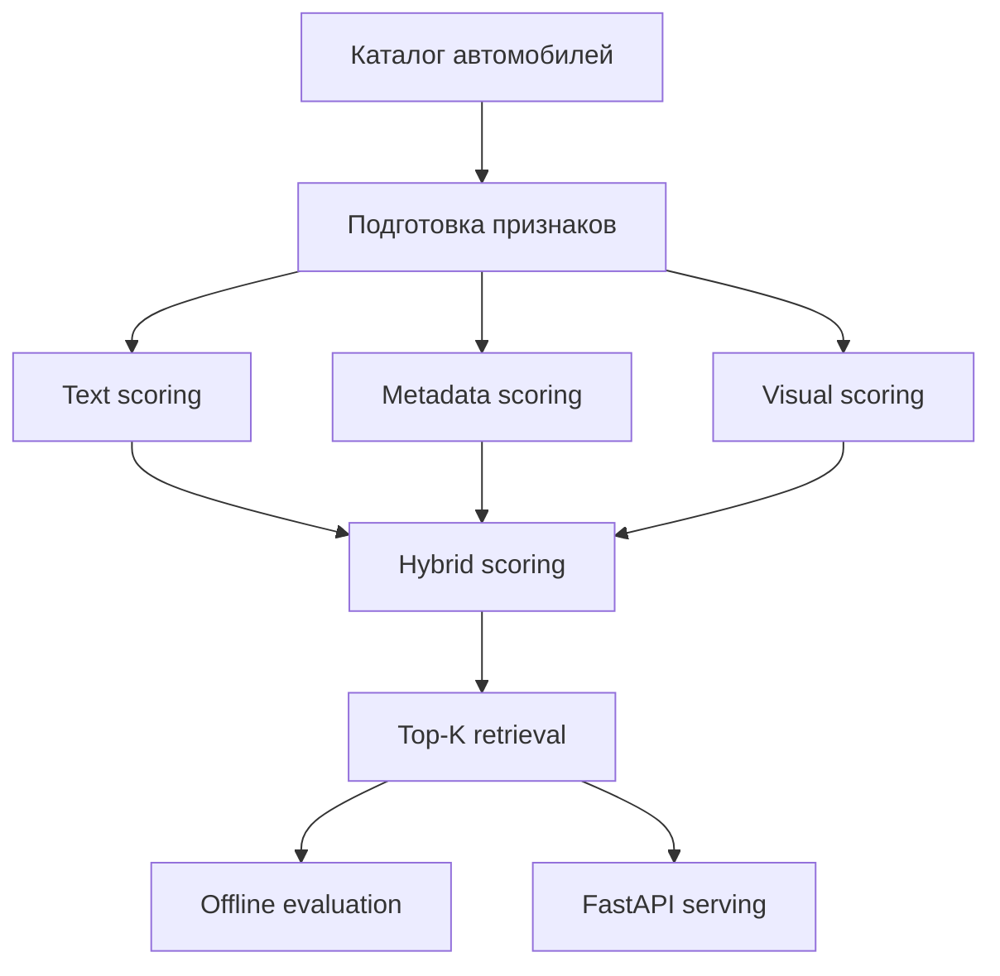

# Vehicle Memory Bank Benchmark

## Кратко
Гибридный retrieval-benchmark для поиска похожих автомобилей в memory bank: text, metadata, visual features, offline evaluation и FastAPI serving.

## Задача
Найти схожие объекты в memory bank транспортных средств, используя несколько сигналов одновременно: текстовое описание, структурированные признаки и лёгкие визуальные признаки.

## Что улучшено
- hybrid scoring устойчивее чисто текстового baseline;
- метаданные улучшают top-1 совпадение по марке и другим атрибутам;
- лёгкие visual features дают прирост без тяжёлой модели и сильного роста latency.

## Архитектура


## Метрики и результаты
Подставить реальные значения из benchmark-логов.

| Режим | Recall@1 | Recall@3 | MRR | top1_brand_match | top1_color_match | latency_ms_p50 | latency_ms_p95 |
|---|---:|---:|---:|---:|---:|---:|---:|
| text-only baseline | TBD | TBD | TBD | TBD | TBD | TBD | TBD |
| text + metadata | TBD | TBD | TBD | TBD | TBD | TBD | TBD |
| text + metadata + visual features | TBD | TBD | TBD | TBD | TBD | TBD | TBD |

Ниже в README обязательно добавить короткий вывод:
- насколько выросли `Recall@1` и `MRR`;
- какой прирост дали metadata и visual features;
- какой ценой по latency дался прирост качества.

## Структура репозитория
- `configs/` — конфигурации benchmark-режимов;
- `data/demo_catalog/` — демонстрационный каталог;
- `src/vehicle_bank/` — логика retrieval, scoring и API;
- `scripts/` — запуск оценки и сервиса;
- `docs/`, `examples/`, `tests/` — документация, примеры и проверки.

## Запуск
```bash
python -m venv .venv
source .venv/bin/activate  # Windows: .venv\Scripts\activate
pip install -r requirements.txt
python scripts/run_benchmark.py --config configs/demo_hybrid.yaml
python scripts/serve_api.py
```

## Ограничения
- benchmark ориентирован на offline-оценку;
- visual features задуманы как лёгкий сигнал, а не как тяжёлый CV-пайплайн;
- качество зависит от полноты атрибутов в каталоге и формата запросов.

## Направления развития
- добавить ablation study по каждому типу сигнала;
- вынести ошибки retrieval по классам автомобилей;
- сравнить несколько способов fusion;
- добавить журнал предсказаний и диагностику спорных случаев.
